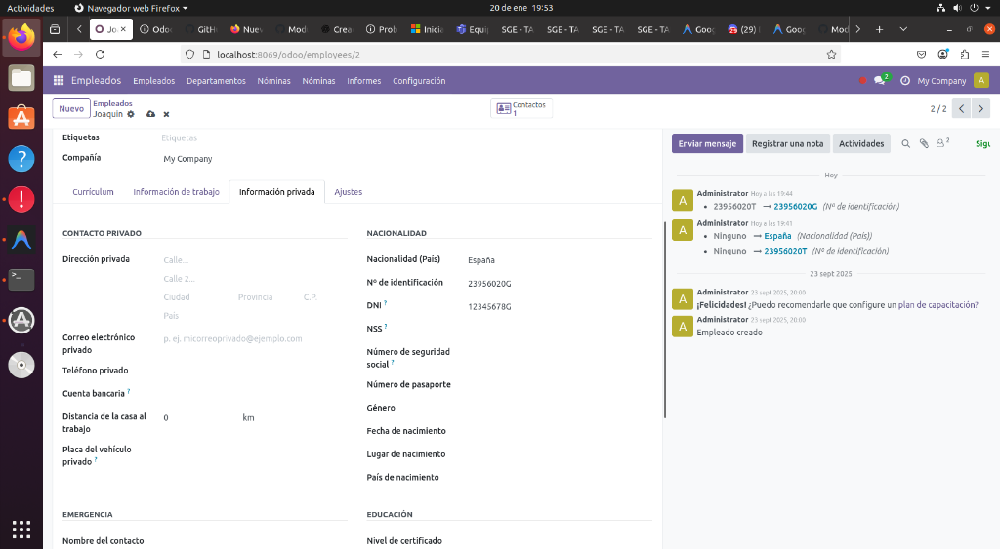

# Tarea 13 – Extensión de Módulos (Gestión de Personal)

Este módulo implementa la **Tarea 13** del curso de **Sistemas de Gestión Empresarial**. El objetivo es extender el módulo base de empleados (`hr.employee`) para incluir y validar identificadores oficiales españoles.

## Objetivos Cumplidos

Siguiendo las especificaciones de la tarea, se han realizado las siguientes implementaciones:

### 1. Extensión del Modelo `hr.employee`
Se ha creado un nuevo módulo que hereda del modelo de empleados para añadir dos nuevos campos:
- **DNI (Documento Nacional de Identidad)**
- **NSS (Número de la Seguridad Social)**

### 2. Lógica de Verificación (Python)
Se ha implementado un método de verificación (`constrains`) que asegura la integridad de los datos introducidos:

- **Validación DNI**:
  - Se comprueba que el formato sea correcto (8 dígitos numéricos seguidos de una letra).
  - Se verifica que la letra de control sea la correcta según el algoritmo del Ministerio del Interior (módulo 23).

- **Validación NSS**:
  - Se verifica que la longitud sea de 12 caracteres.
  - Se valida la estructura: 2 dígitos de provincia + 8 dígitos identificativos + 2 dígitos de control.
  - Se comprueba que los dígitos de control sean correctos mediante el cálculo: `(Provincia + Número) % 97`.

### 3. Actualización de la Vista (XML)
Se ha extendido la vista de formulario del empleado (`hr.view_employee_form`) utilizando **XPath**.
- Los nuevos campos **DNI** y **NSS** se visualizan correctamente en la ficha del empleado, situados tras la información de contacto básica.

## Instalación y Uso
1. Instalar el módulo en la instancia de Odoo.
2. Acceder al módulo de **Empleados**.
3. Al crear o editar un empleado, completar los campos **DNI** y **NSS**.
4. El sistema impedirá guardar si los datos no cumplen con el formato o la validación matemática.

## Capturas de Pantalla

### Vista del Formulario
Los nuevos campos **DNI** y **NSS** aparecen integrados en la pestaña "Información Privada".

### Validación de Errores
Ejemplo de mensaje de error cuando la letra del DNI no corresponde al número introducido.

